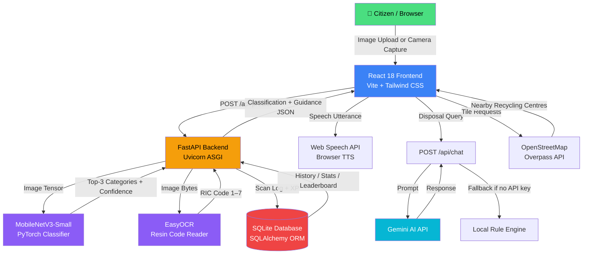

# Architecture

## System Architecture

---

## Components

| Component | Technology | Responsibility |
|---|---|---|
| **Frontend** | React 18, Vite, Tailwind CSS, Framer Motion | SPA delivering all citizen and municipality UI; manages auth state, camera access, and speech synthesis |
| **Backend API** | FastAPI, Uvicorn, Pydantic, Python-Jose | REST API gateway; orchestrates ML inference, OCR, chat, auth, and database operations |
| **AI Classifier** | PyTorch, MobileNetV3-Small (`model.pth`) | Classifies waste images into 9 categories with top-3 confidence scores at ~24 ms/image |
| **OCR Module** | EasyOCR (`resin_model.py`) | Detects and maps Resin Identification Codes (RIC 1–7) on plastic packaging |
| **Auth Service** | Python-Jose (JWT), Passlib (Bcrypt) | Stateless JWT authentication; bcrypt password hashing; role-based access (citizen / municipality) |
| **Database** | SQLite, SQLAlchemy ORM | Persists users, scan history, XP, badges, and streaks; lightweight single-file DB for zero-ops deployment |
| **AI Chatbot** | Google Gemini AI API + local fallback | Answers disposal and upcycling queries; local rule engine handles offline / no-key scenarios |
| **Map & Locator** | React-Leaflet, OpenStreetMap, Overpass API | Renders interactive map; queries Overpass for recycling and e-waste centres within configurable radius |
| **Speech Output** | Web Speech API (browser-native) | Reads disposal instructions aloud; zero latency, zero cost, no external dependency |
| **Gamification Engine** | Custom logic in `main.py` + React state | XP calculation, level thresholds, badge unlock conditions, streak tracking |
| **Municipality Dashboard** | Recharts, FastAPI aggregate queries | City-wide recycling rate charts, contamination metrics, waste distribution, citizen leaderboard |

---

## Data Flow

### Primary Flow — Waste Classification

1. **Image Capture** — Citizen captures a photo via the browser's `getUserMedia` API or uploads a file. The React frontend sends a `multipart/form-data` POST to `POST /api/predict`.
2. **Preprocessing** — FastAPI receives the image bytes, decodes them with Pillow, resizes to `224×224`, and applies ImageNet normalisation (`mean=[0.485, 0.456, 0.406]`, `std=[0.229, 0.224, 0.225]`).
3. **MobileNetV3 Inference** — The normalised tensor is passed through the loaded `model.pth`. Softmax is applied and the top-3 `(class_name, confidence)` pairs are extracted.
4. **EasyOCR Branch** — If the top-1 prediction is `Plastic`, the raw image is passed to `resin_model.py`. EasyOCR scans for digit patterns matching `[1-7]` (optionally inside a triangle symbol). The detected code is mapped to its polymer name and a recyclability verdict.
5. **Circular Decision Engine** — Category + polymer type (if present) are passed through a lookup table that returns: assigned bin colour, preparation steps, contamination warnings, and CO₂ savings per kg.
6. **Response** — A JSON payload is returned containing category, confidence scores, resin data (if applicable), bin assignment, disposal steps, and CO₂ impact.
7. **Persistence** — If the user is authenticated (JWT Bearer token present), the scan is written to the `scans` table. XP is awarded and the daily streak is updated in the `users` table.
8. **Voice Guidance** — The frontend passes the disposal steps string to the Web Speech API `SpeechSynthesisUtterance` and speaks it automatically.

### Secondary Flow — Municipality Analytics

1. Authenticated municipality users log in with the `municipality` role.
2. `GET /api/municipality/dashboard` runs aggregate SQL queries over the `scans` table grouped by waste category, date, and ward (if location data is present).
3. The React dashboard renders Recharts bar and pie charts for recycling purity, material distribution, carbon reduction milestones, and a top-10 citizen leaderboard.

### Secondary Flow — AI Chatbot

1. Citizen types a disposal or upcycling question in the chat drawer.
2. `POST /api/chat` sends the message to the Gemini AI API with a system prompt constraining responses to sustainability and waste management topics.
3. If `GEMINI_API_KEY` is not set or the API is unreachable, the local rule engine (`main.py`) matches keywords against a 50-entry lookup table and returns a pre-written response.

---

## API Endpoints Reference

| Method | Endpoint | Auth | Description |
|---|---|---|---|
| `POST` | `/predict` | Optional | Image classification + OCR + disposal guidance |
| `POST` | `/auth/signup` | None | Register new citizen or municipality account |
| `POST` | `/auth/login` | None | Obtain JWT access token |
| `GET` | `/auth/me` | JWT | Get current user profile |
| `GET` | `/history` | JWT | Paginated scan history for current user |
| `GET` | `/stats` | JWT | Aggregate CO₂ savings, XP, badge count, streak |
| `GET` | `/leaderboard` | JWT | Top citizens by XP |
| `GET` | `/municipality/dashboard` | JWT (municipality role) | City-wide waste analytics |
| `GET` | `/municipality/users` | JWT (municipality role) | All registered citizens with stats |
| `POST` | `/chat` | Optional | AI chatbot message exchange |
| `GET` | `/health` | None | Backend and model readiness check |

---

## Security Considerations

- **No secrets in source** — All API keys (`GROQ_API_KEY`, `SECRET_KEY`) are read from environment variables; `.env` is in `.gitignore`.
- **JWT with expiry** — Tokens expire after `TOKEN_EXPIRE_HOURS` (default 168 h / 7 days), configurable via environment variable.
- **Bcrypt password hashing** — Passlib with `bcrypt` scheme; raw passwords are never stored.
- **Role-based access** — Municipality dashboard endpoints validate the `role` claim in the JWT; a citizen token cannot access aggregate data.
- **CORS** — FastAPI CORS middleware restricts origins to the frontend URL in production.
- **File validation** — Uploaded images are validated for MIME type and maximum size before being passed to the ML pipeline.

---

## Scalability Notes

| Bottleneck | Mitigation Path |
|---|---|
| **CPU inference latency** | Replace `model.pth` with a watsonx.ai hosted endpoint or deploy on a GPU-enabled container for sub-10 ms inference |
| **SQLite concurrency** | Migrate to PostgreSQL (connection string swap in `DATABASE_URL`) for multi-worker or multi-instance deployments |
| **EasyOCR cold start** | Pre-load EasyOCR reader at application startup (already implemented in `resin_model.py`) to avoid per-request initialisation overhead |
| **Frontend bundle size** | Vite code-splitting is configured; Recharts and Leaflet are dynamically imported on their respective pages only |
| **Single backend instance** | FastAPI is stateless; horizontal scaling behind a load balancer requires only shared database access (PostgreSQL) and shared JWT secret |
